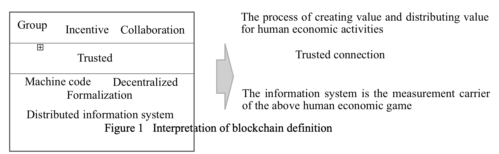
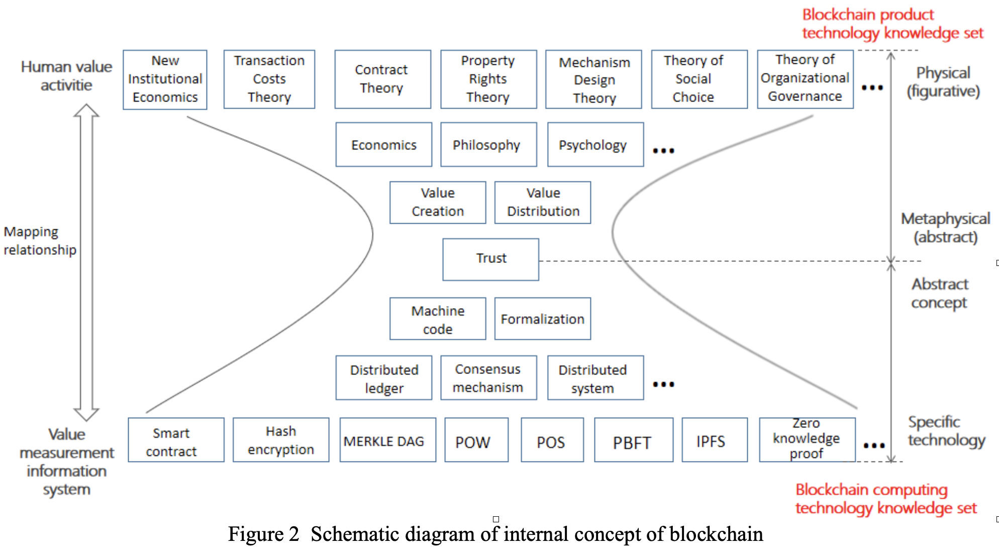
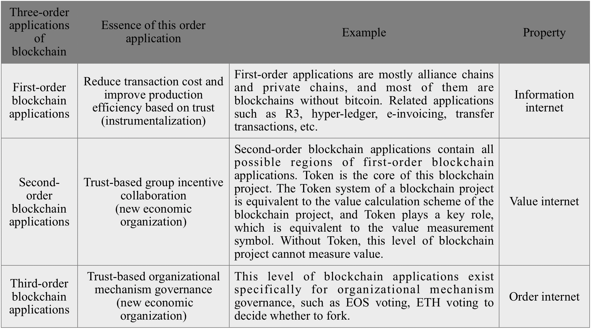
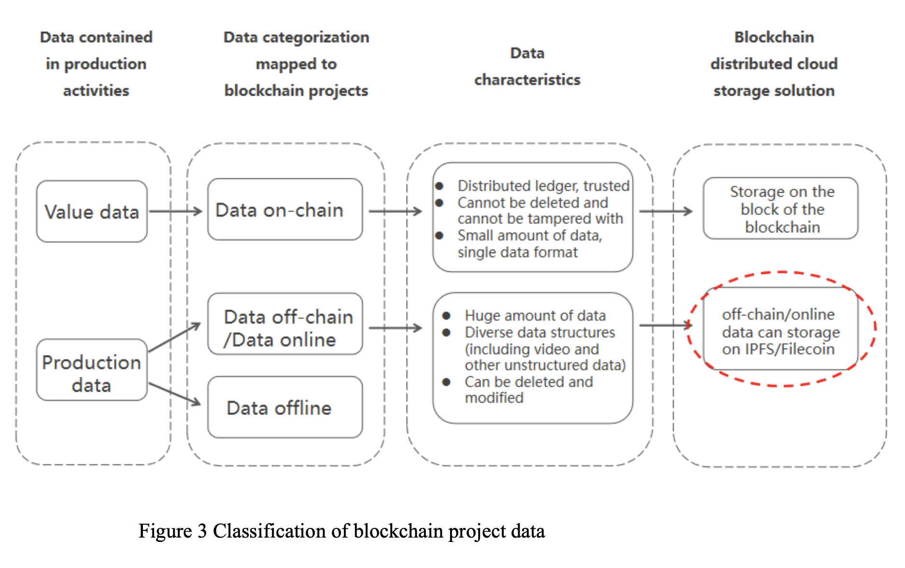
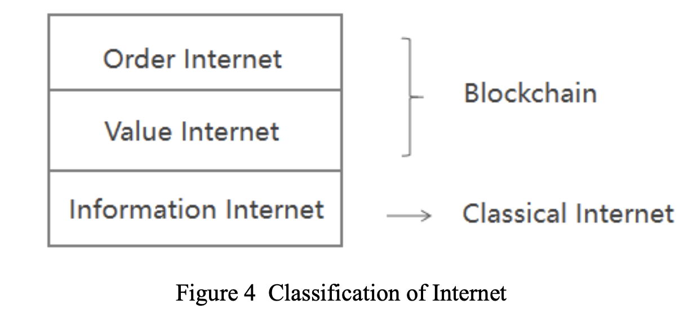
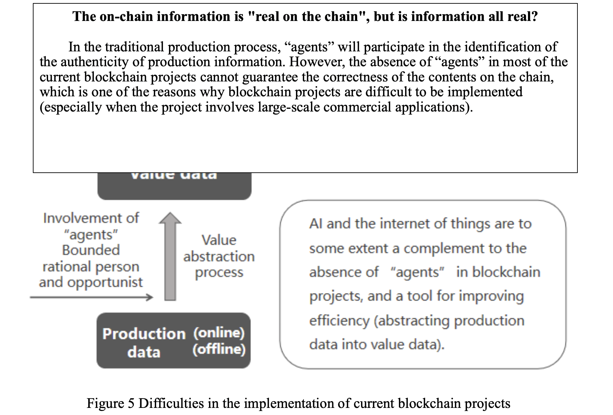
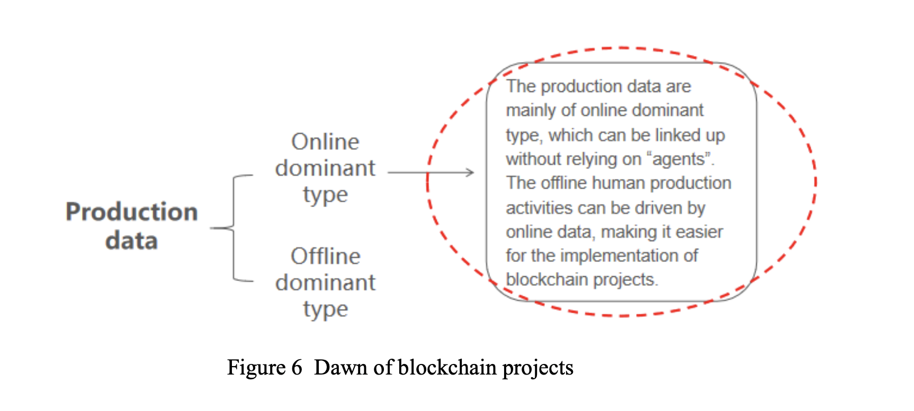

**Essential Thinking of Blockchain (Concise Version)**

- Keywords: Blockchain, Token, Token entity, Tokenlogy, Tokenist, Tokener, Tokenism, Token spirit, Token economy, Token economics, Token governancelogy, Token computing science.

Content：

- [1.Foreward](#Foreward)
- [2.What is Blockchain](#What-is-Blockchain)
    - [2.1 Definition of blockchain](#Definition-of-blockchain)
    - [2.2 Schematic diagram of internal concept of blockchain](#Schematic-diagram-of-internal-concept-of-blockchain)
    - [2.3 Division of blockchain applications](#Division-of-blockchain-applications)
    - [2.4 Classification of blockchain project data](#Classification-of-blockchain-project-data)
    - [2.5 Difficulties in the implementation of current blockchain projects](#Difficulties-in-the-implementation-of-current-blockchain-projects)
    - [2.6 Dawn of blockchain projects](#Dawn-of-blockchain-projects)
    - [2.7 Rethinking of the definition of blockchain](#Rethinking-of-the-definition-of-blockchain)
- [3.Tokenlogy（to be continued)](#Tokenlogy)
    - [3.1Token](#Token)
    - [3.2 Token entity](#Token-entity)
    - 3.3 Token economy
    - 3.4 Introduction to Tokenlogy
    - 3.5 Token economics
        - 3.5.1 What kind of human needs are satisfied by the second and third-order applications of blockchain technology?
        - 3.5.2 User needs in the new era
        - 3.5.3 A Brief Discussion on the New Theory of Value Affirmation
        - 3.5.4 Tokenism
        - 3.5.5 Tokener and Token sprit
        - 3.5.6 The competitiveness of token system
        - 3.5.7 Analysis of the structure of the token economy
    - 3.6 .Token governancelogy
        - 3.6.1 The nature of token entity

        - 3.6.2 Token entity ---- Dissipative structure analysis

        - 3.6.3 Permanent institution of token entity

        - 3.6.4 Token entity governance mechanism
          3.7.Token computing science

          

1.Foreword

It has been 10 years since the publication of the paper entitled Bitcoin:A Peer-to-peer Electronic Cash System by Satoshi Nakamoto in 2009, and Bitcoin is widely known as a cryptographic currency. At present, people have shifted their attention from Bitcoin to its underlying technology, blockchain.

There is a lot of controversy surrounding blockchain, and people still have different opinions about it. Up to now, there has not been a unified understanding of the definition of blockchain, and the concept of blockchain is full of confusion from the connotation to the extension. Some people think that blockchain is a distributed ledger and a distributed data technology; some people think that blockchain is machine trust; some other people assert that blockchain is a chain data structure, and only in line with the chain data structure is a blockchain, and therefore judge that DAG technology is not a blockchain. Since most blockchain projects involve the transaction of tokens, some people believe that the quantitative high-frequency transaction of the token market is also the category of blockchain. As for how to apply the blockchain technology, there has been a dispute over the blockchain without token and the blockchain with token. Some people think that given the ICO financing chaos, should only develop a blockchain without token; while proponents of a blockchain with token say that a blockchain without token is a soulless blockchain that doesn’t deserve attention. Blockchain participants are people and organizations of all kinds: fraudsters, idealists, pragmatists, investors, speculators, academics, universities, companies, and governments. They are all trying to dig the value of blockchain. There has never been a technology that can bring such confusion to humans.

What can blockchain technology bring to humans? Currently, only a few literatures have made reasonable guesses on the impact of blockchain technology on human society, such as “programmable society”, etc.

The above points of view represent the human curiosity and exploration of the new technology of blockchain. However, the author of this article believes that although there are many current views, the general understanding of blockchain is still at a relatively shallow level. The public has made a simple on-site listing of a series of phenomena related to blockchain that have not yet formed a systematic knowledge pedigree and unified description of the theory of blockchain. It’s hard to see the full picture of blockchain.

Therefore, the author came up with a bold idea, trying to make a general overview of blockchain: give a clear conceptual definition from the definition of blockchain, and then discuss the essence of blockchain projects, blockchain project classification and other specific issues. Then, discuss a new paradigm of human organization, token entity which is triggered by blockchain technology, and a new subject, Token science, for the study of token entity. Token science will be a new science, which studies various human activities arising from new human organization paradigm promoted by blockchain technology, covering philosophy, mathematics, economics, political science, psychology, sociology, law, complexity, management, dissipation theory, synergism, cognitive science, computational science, and other disciplines that intersect many fields. The establishment of Token science will deepen the research on how blockchain technology affects the evolution of human society, with far-reaching significance.

Before my formal argument, I present to you one of my conclusions from my research into the token entityal form.

**Blockchain technology will cause institutional changes in human society and evolve towards a better social system - Tokenism with decentralized wealth system as the core.**

**2 .What is Blockchain** 

**2.1 Definition of blockchain** 

Definition of blockchain: Decentralized distributed group incentive cooperative information system based on machine code formalization to prove trustworthiness.

This definition is relatively long, how to quickly understand it? We use the central word for text analysis.

Decentralized distributed group incentive cooperative information system based on machine code formalization to prove trustworthiness

Conclusion: Trusted information system.

So the next thing to think about is, how can this information system be trusted? The answer is: based on machine code, formalization, decentralized, and distributed.

And what is this trusted information system for?  The answer is: For group incentive collaboration.

The definition of blockchain can be understood in three parts: The core of the center section is “trustworthiness”; the above part of “trustworthiness” represents human economic activities, which is the process of value creation and value distribution, of which the characteristics can be summarized as “group, incentive, and collaboration”; and the below part of “trustworthiness” is the information system, which is the computing information carrier of human economic game activities, and its characteristics are “machine code, formalization, decentralized, distributed and information system”. The computer system of the lower part produces a trustworthy information system, which connects the “human economic activities” of the upper part through “trustworthiness” to form an organic whole.

It can be simply compared to the HRM system (human resource management system). The lower part is the specific calculation program code of HRM, and the upper part is the specific rule of HRM, which is the code of conduct for employees to abide by. The company has developed HR norms, which are formed into HRM information system through the IT section through the machine code. Employees can carry out various activities in the HRM system, such as clocking in at work, employee information input and so on.

Similarly, blockchain is also an information system, whose most prominent feature is the “trustworthy” information system. Now, we have an intuitive perceptual understanding of blockchain. It is a formalized and trusted information system manufactured by machine code, based on which groups can perform the incentive and coordination of various economic activities. This economic entity, which links the trustworthy information systems of people and machines, is called the token entity.

**2.2 Schematic diagram of internal concept of blockchain**

**Blockchain project is essentially a value calculation scheme for specific human economic activities.**

Figure 2 is the result of a deeper understanding of Figure 1. The core of the picture is still “trustworthiness”, which plays a role in linking up and down. So, where does the trust in the blockchain come from?

Blockchain is often said to be a trust machine that relies on an information system. First, the information system is composed of machines that are not dependent on humans. It is achieved through formalization (mathematical verification). Secondly, each lower layer provides support for its upper layer, such as “how to achieve formalization”, which is supported by consensus mechanism of the next layer; and how to implement the consensus mechanism can be realized by the specific consensus algorithm of the next layer, such as POW, POS, POC, PBFT, etc. Thus, we can understand the lower half of Figure 2 as a blockchain computing technology knowledge set, which studies how to efficiently implement a trusted information system. It is the business support layer and should serve the business. What kind of support layer the business needs, and what kind of technology should be developed by the support layer.

When we understand how an information system that supports “trustworthiness” is implemented efficiently, we can look at the blockchain-based technology debate in another new perspective. For example, does DAG count as blockchain technology? Those in doubt have confused the name and reality of the blockchain concept. They think of blockchain as a chain structure, and only a chain structure is a blockchain. This is a very wrong understanding. In fact, a more reasonable explanation should be: “Blockchain” is a phrase, a symbol (name), and its definition (reality) is constantly changing. With the above cognition, we can consider DAG (directed acyclic graph) technology as the blockchain technology, as it is also an integral part of the underlying technology of trusted information system. IPFS also belongs to blockchain technology, and so on. Whatever the technology, if it can affect the underlying data structure of the blockchain and be formalized and trustworthy, it is part of the blockchain.

Once we have clarified the misunderstanding of blockchain computer technology, we have reason to believe that blockchain computer technology can be iterated more quickly. Because, when we recognize that the purpose of blockchain computing practices is to achieve more efficient information systems, investors will also have a better sense of what is worth investing in. The development direction of trusted information system must be high efficiency and low energy consumption. It indicates that high efficiency and low energy consumption are the criteria to judge the progress of blockchain technology. If there is a new consensus mechanism that does not require unnecessary hash collisions and can efficiently build trusted information systems, we will have to admit that this is progress and this blockchain technology is worth investing in. Currently, people compare bitcoin mining to gold mining, which is actually disguised replacement of concept. Gold is a tangible substance, its intrinsic value is given by practicality and scarcity; while the consensus algorithm is an abstraction. The analogy between abstract objects and real objects is confusion of concepts. The energy consumed by the POW consensus algorithm is wasted rather than the value of anchoring real energy. Such obvious knowledge is hard to distinguish after being wrapped by blockchain, which is one of the reasons why the blockchain project is chaotic. Since blockchain technology is too new, the public does not know enough about it, and even some traditional financial investors can hardly see the truth. It is one of the original intentions of this paper to provide a more scientific perspective for investors and the masses to understand the blockchain, participate in the blockchain, and promote the development of blockchain.

Next, let’s look at the top half of Figure 2. The first half of the internal concept diagram of blockchain is the technical knowledge set of blockchain products, which is the knowledge combination describing the value calculation scheme of human economic activities.

Here I divide the blockchain technology into two parts, one is computing technology and the other is product technology. Take the Internet project as an example, the technology of an internet project is divided into two categories, one for computer technology and the other for product technology. Generally, there are two corresponding positions in internet companies, one is the R&D manager and the other is the product manager. The product manager is to study the user needs and summarize and logically express the user needs; the R&D manager receives the product requirements from the product manager and formalizes (codes) the product requirements. Similarly, there is such a division of labor in the blockchain project, the product manager of the blockchain and the R&D manager of the blockchain. The lower part of the diagram is essentially the responsibility of the R&D manager of the blockchain, while the upper part of the diagram is the responsibility of the product manager of the blockchain.

Blockchain projects have a distinctly rationalistic constructionism. It is a pre-planned economic activity.

How to understand that the blockchain project is essentially a value calculation scheme for a specific human economic activity? One might ask, is there a way else to calculate the value of human economic activity before the blockchain emerges? The answer is yes. The value calculation scheme here is understood in the broadest sense. Different social systems are different value calculation schemes. The market economy is also a kind of value calculation scheme, and the company is also a kind of value calculation scheme...

Then what is the essential difference between the value calculation scheme of blockchain project and the previous value calculation scheme? The difference is that the blockchain project constructs a Token system through the blockchain technology, and the value calculation scheme of the Token system is intentionally and artificially designed in advance.

Kant said that Human beings should be treated as 'ends' and not as 'means'. With the progress of human society, the value generated by individuals is more and more needed to be recognized and accurately calculated in the organization system. The emergence of blockchain project will bring a new experimental site for humans - Token entity - which will be used to discuss value creation and value distribution.

The value creation, value allocation, value exchange and value calculation schemes of Token entity are blank in theory at present. This paper will give a preliminary discussion on this (see the overview of Token science).

**2.3 Division of blockchain applications**

According to the theory of higher-order predicate logic, blockchain applications can be divided into three-order applications.

First-order applications are based on trust to reduce transaction costs and improve productivity. This order of blockchain application instrumentalizes blockchain technology, such as JP Morgan’ JPM Coin. This order of application does not involve group incentive and collaboration, which can be understood as the information internet adopting blockchain technology. This order of application is based on blockchain technology to construct a trusted information system, so as to reduce the suspicion of both sides of the transaction to zero, and thus save transaction costs, thereby improving the production efficiency. First-order applications can be called information internet.

Second-order applications are based on trust to reduce transaction costs and improve productivity, and perform group incentive collaboration in the trusted information system, such as bitcoin, Ethereum, which involves the exchange of value among groups. Obviously, all current blockchain projects are still at a fairly shallow level in terms of value exchange, however everything has a head start. Till now, none of the blockchain projects of second-order has been successfully linked to the real economy of mankind. Both Ethereum and EOS are half of the landing projects. Ethereum and EOS are currently just betting games landed. These applications are not really linked to real human economic activity. But we see the clue of blockchain landing from Ethereum and gambling DAPP of EOS. Second-order applications can be called value internet.

Third-order applications are the group collaboration and organizational governance generated based on trust to reduce transaction costs and improve production efficiency, and perform group incentive collaboration in the trusted information system, such as EOS and ETH proposals, although they are rudimentary. Third-order applications are natural requirements for second-order applications. The second-order applications are the group motivation cooperation. Where there is group incentive cooperation, there is human game; where there is game, there is coordination. Third-order applications exist for the organizational governance of the token entity, which construct the governance mechanism for the token entity. Third-order applications can be called order internet.

The characteristic of higher order predicate theory is that higher order includes lower order. First-order applications can be independent of second- and third-order applications. Generally speaking, a non-first-order blockchain project should contain first-order, second-order and third-order applications.

When we are clear about the classification of blockchain applications, the dispute between the blockchain with bitcoin and the blockchain without bitcoin will be resolved naturally. A first-order application can be called a blockchain without token. Even if there is a token in the first-order application design, it does not indicate that the token has the function of value transfer, and this token only plays an auxiliary role. As the second- and third-order blockchain application is a value calculation scheme for specific human economic activities, token must be used for incentive purpose.

Now we discusses the first-, second- and third-order applications of blockchain from the perspective of innovation theory. Blockchain technology has both breakthrough innovation and disruptive innovation applications. First-order applications are breakthrough innovations, second- and third-order applications are disruptive innovations.

**Breakthrough innovation**: The meaning of breakthrough is to innovate on the original basis. Therefore, breakthrough technologies are often maintenance technologies. Breakthrough innovations are all about maintaining the interests of existing stakeholders. Breakthrough innovations are all about adding value to existing markets. As a result, we see that most of the companies and organizations engaged in first-order blockchain applications are current market giants, and they are vested interests, such as Alibaba, Tencent, Baidu, Huawei, IBM, major global banks, Facebook, Google, AWS, Nasdaq, etc. Major cloud computing service providers in the promotion of BaaS (blockchain as a service), is to promote their own cloud services. Nasdaq would adopt the blockchain technology to construct STO platform, which is the interest derivative of the existing stock issue. Blockchain technology has shown extremely broad market potential in the first-order applications. Blockchain technology in the first-order applications is waiting for the vast number of aspirants to explore.

**Disruptive innovation**: Also known as disruptive innovation, it is an innovative activity that runs counter to mainstream market trends. Its destructive power is so great that most successful companies struggle to adapt to the challenges posed by such innovations. Therefore, with the existing enterprise mentality and interest mechanism, it is difficult to break through the dilemma caused by this destructive innovation. Small and medium-sized enterprises need to promote this innovation by starting from scratch outside the system, with new markets and new values emerging at the edges.

The concept of disruptive innovation was first put forward by the economist Schumpeter in 1912 and perfected by Clayton Chiristensen, a professor at Harvard Business School in the United States, in 1997.

Schumpeter viewed innovation as the constant internal innovation of economic structures, that is, the constant destruction of old structures and the constant creation of new ones. He also believed that innovation is a new combination of factors of production by entrepreneurs, namely “establishing a new production function”, whose purpose is to obtain potential profits. Innovation is the process of making  investments in fixed equipment and capital to obsolete, ineffective, or devalued. Innovation generates a lot of new capital (profits) to compensate for these devaluations and inefficiencies.

The main route of disruptive innovation is to construct new markets and discover new values. It does not tinker with existing markets, but directly creates new markets and discovers new value.

Second- and third-order blockchain applications are disruptive innovations. Its destructive power is tremendous. It is to produce a kind of brand-new mankind economic organization directly. In the current market economy, a new organization - Token eorganization - is inserted among people, families, enterprises, markets, governments and countries. This is another new form of economic organization in human society. Its destructive innovation has been beyond the scope of innovation theory of management. It creates value far beyond the shallow commodity values that business is talking about today. The value created by the second- and third-order blockchain applications self-referent to the problem of human value creation and value distribution. It needs to be examined from philosophy, economics, political science, sociology, psychology, cognitive science and so on.

“New” do not necessarily mean “good”. In the process of biological evolution, new species evolve all the time. A new species does not mean competitive; only the species that wins the competition is good. Whether the token entity generated by blockchain technology is competitive this time and whether it can become one of the normal economic organizations of human beings in the future. The main task of this paper is to discuss it.

The first-order blockchain applications are obvious, even traditional Internet product managers are qualified for it. It is nothing more than to supplement and learn the knowledge of Token computing. The second- and third-order blockchain applications are more complex, and Token science focuses on the second- and third-order blockchain applications.

We need to be mindful of the disruption that disruptive innovation can bring to the economic system.The change we hope is a gradual replacement for slow mutations.

**2.4 Classification of blockchain project data**

How to classify the blockchain project data?

Since the space on the blockchain is limited, we cannot put all the data on the blockchain, and thus we have to distinguish the data types. I divide blockchain project data into value data and production data. So, how to distinguish value data from production data?

For example, a blockchain video website, where users subscribe to the film Transformers - the information is value data. The textual data of Transformers is the production data. We broadly understand that information that involves the exchange of value can be treated as value data. In this way, we can work together well with the blockchain project.

It is based on the classification of value data and production data. I investigated the behaviors associated with blockchain including on-chain, off-chain and offline behavior. A complete blockchain information system should include the on-chain information system and the off-chain information system. A complete token entity should include the on-chain information system, the off-chain information system, and the offline  physical world information system. The on-chain information system and the off-chain information system of the token entity belong to the formalized world; and the off-chain physical world information system is the non-formalized world of the physical world.

Since the space on the blockchain is limited, we cannot put all the data on the blockchain, and thus we have to distinguish the data types. I divide blockchain project data into value data and production data. So, how to distinguish value data from production data?

For example, a blockchain video website, where users subscribe to the film Transformers - the information is value data. The textual data of Transformers is the production data. We broadly understand that information that involves the exchange of value can be treated as value data. In this way, we can work together well with the blockchain project.

It is based on the classification of value data and production data. I investigated the behaviors associated with blockchain including on-chain, off-chain and offline behavior. A complete blockchain information system should include the on-chain information system and the off-chain information system. A complete token entity should include the on-chain information system, the off-chain information system, and the offline  physical world information system. The on-chain information system and the off-chain information system of the token entity belong to the formalized world; and the off-chain physical world information system is the non-formalized world of the physical world.

Take Yangcheng Lake hairy crab as an example. The local agriculture bureau issues labels to local farmers for protection of origin. There are problems in the process of release. How do you know how many hairy crab are raised in each household? How to apply? How to release? Local farmers have every incentive to buy hairy crabs raised elsewhere and pass them off as Yangcheng Lake hairy crabs. None of these problems can be solved by the current blockchain. The current technological solution is to use cameras, internet of things, artificial intelligence and logistics chains to solve the problems. Thus the production cost is huge, and there is currently no possibility of feasibility. (It can be solved in the future. See the rethinking of the definition of blockchain in 2.7.)

**2.6 Dawn of blockchain projects**

At present, some economic activities of human beings are online dominant type. Online dominant type refers to online behavior driven offline behavior, or just online behavior. So,there is no such thing as the process of putting information from the offline physical world onto a chain. According to Classification of blockchain project data(see 2.4) that a complete token entity should include on-chain information systems, off-chain information systems, and offline physical world information systems. On-chain information systems of the token entity is formalized. Online dominant is the value exchange behavior that formalizes the on-chain world’s values and dominates the offline physical world. Therefore, there is no such thing as an agent. All behaviors can be verified by on-chain information systems against off-chain information systems (this is the source of business requirements to be layered in the consensus layer of the blockchain architecture).

Take Filecoin as an example. Filecoin is an online dominan type blockchain project which is distributed cloud storage project (DSN) and content distribution network (CDN). Filecoin is the incentive layer of IPFS, which is equivalent to “Uber” of shared hard disk industry. It is the world’s first blockchain project linked to the real economy. Filecoin is a decentralized storage network (DSN), a free trading market for cloud storage that implements its protocols through the Filecoin project. Miners get tokens (also known as “filecoin”) by providing data storage or retrieval. On the contrary, customers pay tokens to miners to store or distribute data and retrieve it. In simply, Fileoin tokenize cloud storage and bandwidth distribution.

Filecoin is the best second- and third-order blockchain application project and one of the few cases for analysis. From blockchain product technology to blockchain computing technology, it is an excellent observation case.

The blockchain consensus of Filecoin is divided into Expected Consensus, Proof of Replication and Proof of Space-Time. EC, RoRe and PoST are complete on-chain information systems.

The mortgage mechanism and distributed cloud service scheme of Filecoin recently proposed by me are off-chain information systems. Off-chain information systems will inevitably communicate with on-chain information systems. Therefore, it is difficult for us to draw a clear boundary between off-chain and on-chain (see Token computing for details).

**2.7 Rethinking of the definition of blockchain**

In the previous section, we solved the online dominant type blockchain project. We also need to address offline dominant type blockchain projects.

We know that the on-chain world is the formalized world, and the offline world is the physical world. There is a natural information gap between them. We can relax the definition of blockchain to meet the needs of offline dominant blockchain projects. In the second stage,My thinking of the definition of blockchain is fault-tolerant blockchain.

In the first stage, the definition of blockchain is:

Decentralized distributed group incentive cooperative information system based on machine code formalization to prove trustworthiness.

In the second stage, the definition of blockchain is:

**A fault-tolerant** decentralized distributed group incentive cooperative information system based on machine code formalization to prove trustworthiness.

However, the definition of how to realize the second-stage blockchain will draw an explosive conclusion: **Feasibility of a community of human interests**. Token entity is not only a threat to companies, but also a threat to the existence of countries divided by ethnic groups and historical paths. **It may eventually lead to a complex community of common destiny with the unity of all mankind and respect for diverse values. The name of the state will disappear, and everything that comes into being in history will** [**certainly**](http://www.baidu.com/link?url=gUEd5Y9awMGIltmdJuHlnWBAQ8upnoSRF_vWo62CMjytPLXLF42FMI0ptby1riG5S0e5HJ9kYMC8jheKUDawcFoHxK070dDjcaa0tO3i6Kda4A2xAenZqjU4tlJ202PH) **perish in history.**

Philosophical thinking always runs through this article. The philosophical essence of the two stages is the difference between Wittgenstein’s linguistic philosophy in the early stage and in the middle and late stage.
